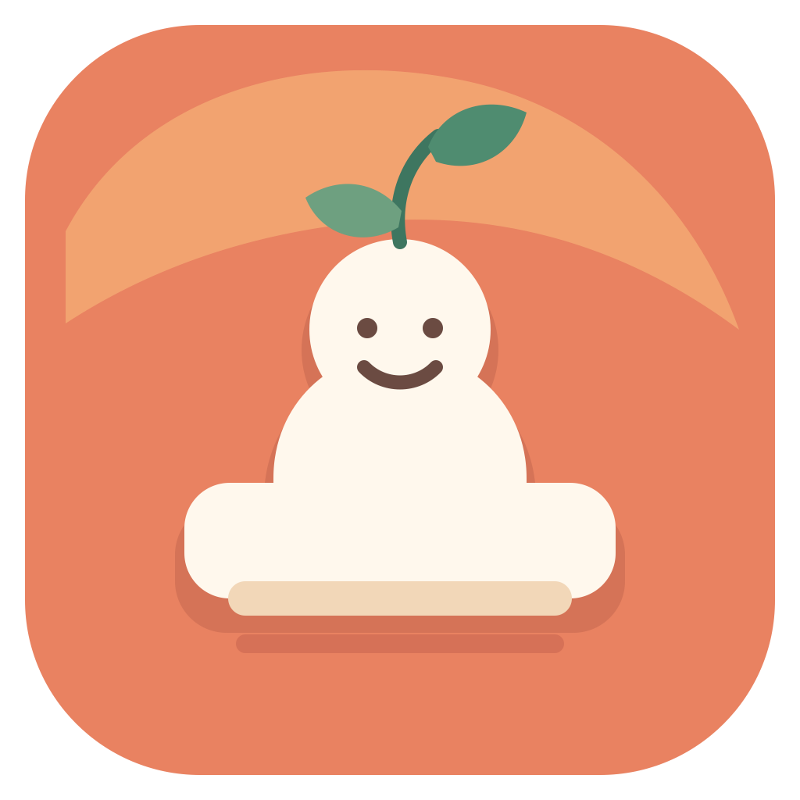

# 小桌伴 MellowDesk

[English](README.md)

<p align="center">
  
</p>

> 放在桌边，轻轻陪你过好每个工作日。

**开源 Beta · macOS 13+ · Apache-2.0**

小桌伴（MellowDesk）是一款安静待在菜单栏的原生 macOS 桌面伴侣，用友好的小提醒帮你在工作时照顾自己。首个公开 Beta 只包含一个功能模块：**颈间（NeckEase）**，通过三个轻柔动作和可选的本地摄像头计次，帮你完成一次简短的颈肩活动。

```text
定时提醒 → 动画跟练 → 摄像头本地计次 → 本地完成记录
```

小桌伴没有账号、云同步、广告、分析或遥测。只有当你主动开始训练时，摄像头才会开启；任何时候都可以改用手动计次。

## 当前 Beta 已实现

- 菜单栏常驻，可设置工作日、工作时段、提醒间隔、声音、推迟、暂停和登录启动。
- 本地通知，支持“开始训练”和“推迟 10 分钟”快捷操作。
- 颈间三动作：左右缓慢转头、左右轻柔侧屈、轻柔低头并回正。
- 动画引导、当前方向、目标次数、到位/回中反馈和完成结果。
- 本地头部姿态计次，包含中立位校准、逐动作方向适配、滤波、迟滞和完整回中检查。
- 摄像头权限被拒绝、设备不可用或识别不稳定时，可切换为手动计次。
- 仅保存在本机的今日、近 7 天和近 30 天完成记录。

喝水、起身、午餐和外卖提醒仅是后续路线图方向，**当前 Beta 尚未实现**。

## 一分钟了解隐私

- 摄像头画面使用 Apple 框架在内存中处理，不录制、不保存、不上传。
- 小桌伴只在这台 Mac 上保存设置和训练汇总，不保存图像、人脸模板、音频或逐帧头部角度。
- App 没有网络 entitlement，也没有账号、云端、广告、分析或遥测集成。
- 你可以随时在设置中清除历史。

在提交涉及隐私的问题前，请阅读完整的 [隐私政策](PRIVACY.md)。

## 动作内容边界

颈间是面向一般成年办公人群的短时活动提醒，不是医疗器械，不提供诊断、治疗或个体化康复方案。请在舒适范围内缓慢完成；如果动作引起不适，请停止。

摄像头阈值是为了方便计次的近似识别阈值，不是医学活动度指标，也不是动作处方。请阅读 [动作内容与依据](docs/EXERCISE_CONTENT.md)，了解内容版本、次数、识别逻辑、参考资料和内容治理规则。

## 运行要求

- macOS 13 或更高版本。
- 与 Swift 5.10 兼容的完整 Xcode。
- 摄像头可选；不使用摄像头也可手动计次。

## 从源码构建

当前仓库提供源码构建 Beta。本地产物使用 ad-hoc 签名，不是官方公证分发包。

构建并打开 App：

```bash
./Scripts/run_debug.sh
```

运行全部自动检查并组装 App：

```bash
./Scripts/check.sh
```

产物位于 `build/MellowDesk.app`，bundle identifier 为 `cn.eigenlogic.mellowdesk`。

## 首次使用

1. 打开 `MellowDesk.app`；如需定时提醒，请允许通知。
2. 从菜单栏叶片图标中选择“开始 3 分钟微运动”。
3. 开启摄像头，或改用手动计次。
4. 短暂正视屏幕，建立中立位。
5. 每项动作开始前，先完成一次不计数的小幅适配动作并回正。
6. 跟随动画完成动作。只有到位短停、再可见地回到中立位后才会计次。

## Beta 已知限制

- 摄像头计次有意采用近似识别，表现会受机型、光线、入镜位置和个人动作影响。
- 首个 Beta 的 App 界面为中文；项目提供英文文档不代表 App 已完成英文本地化。
- 从源码构建的 App 使用本地 ad-hoc 签名。正式公开二进制分发仍需 Developer ID、Hardened Runtime 和公证。
- 除自动测试外，还必须在至少一台真实 MacBook 前置摄像头上完成验收；请使用 [真人摄像头验收清单](docs/TEST_CHECKLIST.md)。

## 项目目录

```text
Sources/MellowDeskCore       动作、校准、计次、统计和提醒日历规则
Sources/MellowDesk           App 生命周期、摄像头、服务、视图模型和 SwiftUI 界面
Tests/MellowDeskCoreTests    Core 确定性测试
Tests/MellowDeskTests        App 层确定性测试
Resources                    Info.plist、沙盒权限和隐私清单
Scripts                      检查、App 组装和本地启动
docs                         产品、技术、动作、测试和发布文档
```

当前仓库包含 **32 个确定性测试**。合成数据自动测试不能替代真实摄像头验收。

## 路线图

后续模块可能包括：

- 喝水提醒；
- 起身和轻活动提醒；
- 午餐和外卖提醒。

路线图只表示探索方向，不代表当前功能或交付承诺。

## 项目文档

- [产品设计](docs/PRODUCT_DESIGN.md)
- [技术设计](docs/TECHNICAL_DESIGN.md)
- [动作内容与依据](docs/EXERCISE_CONTENT.md)
- [真人摄像头验收清单](docs/TEST_CHECKLIST.md)
- [发布流程](docs/RELEASING.md)
- [隐私政策](PRIVACY.md)
- [参与贡献](CONTRIBUTING.md)
- [社区行为准则](CODE_OF_CONDUCT.md)
- [安全政策](SECURITY.md)
- [变更记录](CHANGELOG.md)
- [v0.1.0-beta.1 发布说明](docs/releases/v0.1.0-beta.1.md)

## 贡献与安全

欢迎提交问题报告、文档改进、测试和范围明确的实现变更。在发起 pull request 前，请阅读 [CONTRIBUTING.md](CONTRIBUTING.md)。动作内容变更还需要额外的依据和版本管理。

请勿在公开 Issue 中附上人脸、摄像头录像、原始姿态数据或个人训练历史。安全或隐私漏洞请按 [SECURITY.md](SECURITY.md) 中的私密流程报告。

## 许可证

Copyright 2026 EigenLogic and MellowDesk contributors.

项目使用 [Apache License 2.0](LICENSE)，归属信息见 [NOTICE](NOTICE)。
