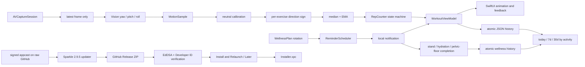
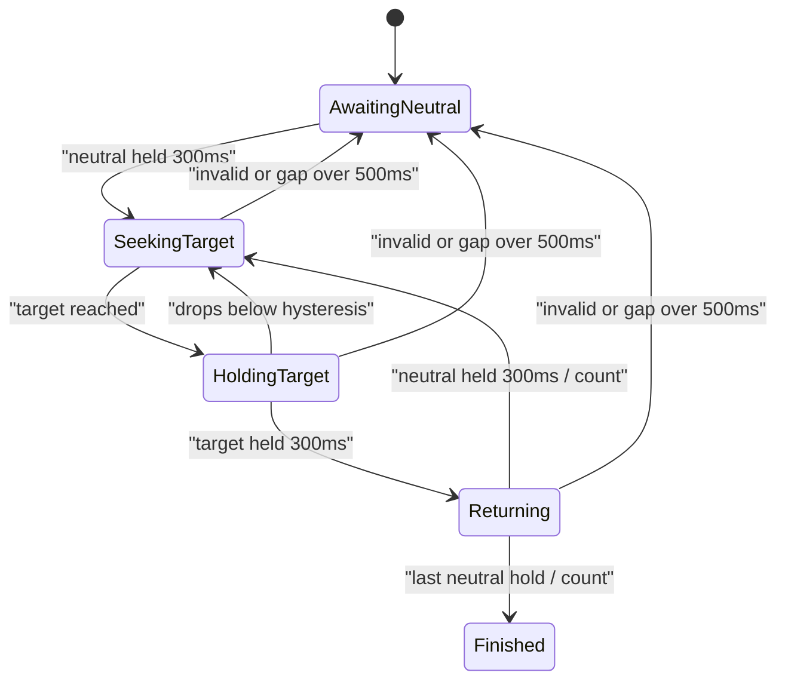

# 小桌伴 MellowDesk：工作健康计划技术设计

## 1. 技术选型

- 最低系统：macOS 13。
- UI：SwiftUI；薄 AppKit 层管理状态栏、悬浮跟练 Popover、持久提醒卡和设置/记录窗口。
- 摄像头：AVFoundation，640×480，优先原生 420f / 420v 像素格式。
- 姿态：Vision `VNDetectFaceRectanglesRequest` revision 3，约 12Hz。
- 动作判断：纯 Swift 校准、median + EMA 滤波和迟滞状态机。
- 存储：UserDefaults 设置 + Application Support 原子 JSON 历史。
- 系统服务：UserNotifications、SMAppService、Sparkle 2.9.5（软件更新）。
- 分发：Swift Package 构建可执行文件和 Sparkle framework，脚本组装、嵌套签名并公证 `.app`。

## 2. 架构与数据流



模块 ownership：

```text
MellowDeskCore
  ExercisePlan / MotionSample / NeutralCalibrator / RepCounter
  WorkoutSession / ActivityCompletion / WellnessPlan / ReminderSchedule

MellowDesk
  Camera       摄像头生命周期与 Vision 推理
  Services     设置、历史、通知、登录启动、Sparkle 生命周期
  ViewModels   训练编排、降级、结果保存
  App          状态栏、Popover 与窗口生命周期协调
  Views        训练、记录、设置、动画
```

## 3. 摄像头管线

`CameraCaptureService` 在专用串行队列配置和启动 `AVCaptureSession`，在另一个串行队列接收 `AVCaptureVideoDataOutput`。`alwaysDiscardsLateVideoFrames = true`，Vision 最多分析 12 帧/秒，因此不会积压旧帧。

预览层仅做水平镜像；送给 Vision 的像素保持原始方向，动作符号只有一个来源。每个被分析的画面会输出一个 `MotionSample`，包括时间戳、三轴角度、跟踪质量、有效性与面部数量。无脸、多脸或三轴不完整也显式输出无效 sample，使状态机能冻结或重置，而不是跨遮挡猜测。

## 4. 校准与计数

训练开始收集约 24 个有效 sample，使用 median 得到 yaw / pitch / roll 中立位，MAD 估计噪声；先尝试严格稳定性校准，连续三次未通过时改用 median 的尽力校准并把中立区钳制在目标阈值的一半以内，避免真实 Vision 抖动阻塞训练。每项动作开始前再引导一次小幅目标方向动作并回正，从真实数据学习该轴符号。转头与侧屈使用相对个人中立位的 15° / 9° 固定保守阈值；轻柔低头根据本次示范的稳定峰值自适应到 5–8°。这些都是摄像头识别阈值，不是医学关节活动度或动作剂量。



左右动作的目标序列是 `左 → 右` 交替。计数发生在完整回中之后；最后一次返回 `.finished`，其内部完成数已经包含最后一次。

## 5. 训练编排

`WorkoutViewModel` 管理：

```text
ready → calibrating → calibratingDirection → exercising → transitioning → completed
```

- 摄像头错误可切换手动模式，并保留已完成次数。
- 暂停、Vision 处理异常或跟练面板被系统暂时隐藏时，立即使当前未完成的一次失效，但保留已完成次数；恢复后重新等待中立位。
- 轻柔低头是唯一的受限例外：必须先由有效帧达到自适应目标；随后若低头使脸部短暂丢失，最多容忍 1.2 秒并可用这段时间完成目标保持，但重新识别到脸后仍须回到中立位并保持才计数。未先达到目标、实际多人、暂停或窗口隐藏都不能借此计数。
- 跟练期间点击状态栏图标只会重新显示并置顶当前面板；完成或跳过后才停止并拆除摄像头。
- 用户从系统设置补充摄像头授权后，状态栏跟练面板自动恢复并继续当前流程。
- 每项达标后生成 `ExerciseResult`，最后生成 `WorkoutSession`。
- 只有完成 session 写入历史；跳过不写历史，并把提醒轮换推进到下一项。

## 6. 提醒语义

默认工作日 09:00–18:00、间隔 50 分钟。工作时段内从当前时间加完整间隔；时段外移动到下一个工作窗口起点。系统中始终只保留一条下一提醒，并按 `stand → water → neck → pelvicFloor` 轮换。补水项目同时打开两分钟起身活动引导，不记录或要求固定饮水量；关闭提肛练习时调度器跳过该槽位。

常驻进程为每个 due time 保留一个轻量 rollover task：到期后创建可跨重启恢复的 `ReminderOccurrence`，并持续显示菜单栏提醒，直到用户开始、推迟或暂停。推迟保留当前 slot；完成或明确跳过会推进 slot。活动开始后复用同一个 `.applicationDefined` 状态栏 Popover，并设置为浮动且不随 App 失焦隐藏；状态栏图标只负责恢复和置顶当前活动，Popover 意外关闭时也会自动恢复，只有完成或跳过才能解除活动状态。从睡眠唤醒、系统时间变化、时区变化和日期变化时重新检查过期状态，不补发一串错过的通知。系统通知只是 App 未运行、App Nap 或睡眠场景下的单条 fallback。

## 7. 持久化

正式 Release 的历史文件：

```text
~/Library/Containers/cn.eigenlogic.mellowdesk/
  Data/Library/Application Support/MellowDesk/workout-history.json
  Data/Library/Application Support/MellowDesk/wellness-history.json
```

源码和 CI 开发包使用 `cn.eigenlogic.mellowdesk.dev` 及 Dev 名称，对应独立的沙盒容器。开发数据、摄像头权限等 macOS 隐私授权不会与 `cn.eigenlogic.mellowdesk` 正式 Release 共用；正式发布脚本会显式恢复生产 bundle identifier 和名称。

App Sandbox 下实际根目录由系统重定向。两个文件都使用 `Data.write(options: .atomic)`；若 JSON 损坏，原文件先移动为唯一的 `*.corrupt-*` 备份，随后恢复空 archive。

核心模型：

```text
Archive
  schemaVersion, sessions[]

WorkoutSession
  id, startedAt, endedAt, status, routineVersion, usedCamera
  results[]

ExerciseResult (results[])
  exerciseID, targetReps, completedReps, mode(camera/manual/timer)

ActivityCompletion
  id, activity(stand/water/pelvicFloor), completedAt, sourceID?
```

历史不单独保存用时；展示时由 `endedAt - startedAt` 计算。

## 8. 自动更新

Swift Package Manager 将 Sparkle 固定在 2.9.5。`SparkleUpdateService` 在 App 生命周期内持有一个 `SPUStandardUpdaterController`：启动后由 Sparkle 读取 `SUFeedURL` 指向的 `https://raw.githubusercontent.com/EigenLogic/MellowDesk/main/appcast.xml`，并负责计划、版本比较、下载、验证和安装。设置中的“自动下载并安装更新”直接读写 Sparkle 的 `automaticallyChecksForUpdates` 与 `automaticallyDownloadsUpdates`；相关偏好和更新器状态由 Sparkle 管理在标准 UserDefaults 中，`AppSettings` 不再复制一套更新字段。

正式包启用 `SUEnableAutomaticChecks`、`SUAutomaticallyUpdate` 和 `SUAllowsAutomaticUpdates`，`SUScheduledCheckInterval = 86400`，所以默认每天自动检查并在后台下载；“现在检查”直接调用 Sparkle 的手动检查入口。`SUEnableSystemProfiling = false`，不会附带系统画像。Beta.4 是首个包含 Sparkle 的种子版本，因此 beta.3 到 beta.4 仍需最后一次手动安装；安装 beta.4 后，后续版本进入这条自动更新链路。

appcast 和发布 ZIP 使用 EdDSA 签名，下载所得 App 还必须通过 Developer ID 代码签名验证。`SURequireSignedFeed` 与 `SUVerifyUpdateBeforeExtraction` 均开启。验证完成后，Sparkle 的 `willInstallUpdateOnQuit` 回调把即时安装闭包交给小桌伴：界面显示“安装并重启”与“稍后”；前者立即退出、替换并重启，后者保留已验证更新并在 App 退出时安装。整个正常流程不构造或打开 GitHub 网页。

## 9. 权限与安全

- `LSUIElement = true`：菜单栏常驻，不显示 Dock 图标。
- `NSCameraUsageDescription`：解释本地实时头部方向识别。
- `com.apple.security.app-sandbox = true`。
- `com.apple.security.device.camera = true`。
- `com.apple.security.network.client = true`，只供 Sparkle 读取 raw GitHub appcast 和下载 GitHub Release ZIP。
- 沙盒 App 启用 `SUEnableInstallerLauncherService` 并随 Sparkle framework 打包 `Installer.xpc`，让已验证更新可在沙盒外完成替换。
- 主 App 的临时 Mach lookup exception 在构建时展开为 `<bundle-id>-spks` 和 `<bundle-id>-spki`；开发包与正式包分别使用自己的 bundle identifier，不保留模板 token。
- 不声明麦克风 entitlement。
- `PrivacyInfo.xcprivacy` 声明 UserDefaults required-reason API；无跟踪、无收集数据类型。
- 源码和 CI 开发包使用 `cn.eigenlogic.mellowdesk.dev`；Developer ID 签名并公证的正式 Release 使用 `cn.eigenlogic.mellowdesk`。
- `Sparkle.framework` 保留原始 symlink 与 `@rpath` 布局；Installer 等嵌套代码先签名，再签 framework 和主 App。公开包所有嵌套代码都使用同一 Developer ID Team、Hardened Runtime 和安全时间戳，并随主 App 完成 Apple 公证。
- 摄像头授权状态、请求和结果写入 macOS 统一日志，仅用于诊断权限流程，不记录画面或头部姿态数据。

## 10. 测试

`MellowDeskCoreTests` 用合成时间序列覆盖：

- 正常完整重复。
- 阈值抖动、单帧尖峰和未达目标。
- 达目标但未可见回中。
- 短遮挡冻结、超过 500ms 遮挡重置。
- 左右交替和双侧配额。
- median / EMA、中立位 median / MAD。
- 不稳定中立位拒绝、中立区上限和暂停失效后配额保留。
- 今日、7 天、30 天统计边界。
- 工作日前后、下班后、周末和 snooze 提醒边界。
- 四项轮换、旧版提醒固定迁移为颈肩、提肛开关跳槽、推迟保槽、完成推进、关闭不推进和重启持久化。
- 起身/喝水/提肛轻量历史的原子写入、幂等去重、日历边界和损坏恢复。
- Sparkle 配置、framework 布局、沙盒 entitlement、嵌套签名、公证和 appcast 资产签名由构建及发布门禁检查。

自动检查入口：

```bash
./Scripts/check.sh
```

### 本轮用户测试门槛

自动测试通过后，还必须按 [真人验收清单](TEST_CHECKLIST.md) 在至少一台真实 Mac 上验证旧 build 到新 build 的后台下载、安装重启、设置与历史保留，并在 MacBook 前置摄像头上验证三轴符号、相对个人中立位的保守阈值、权限拒绝、摄像头占用、关闭后释放和一组计数误差。未完成该清单时，不将本轮用户测试标记为通过。
